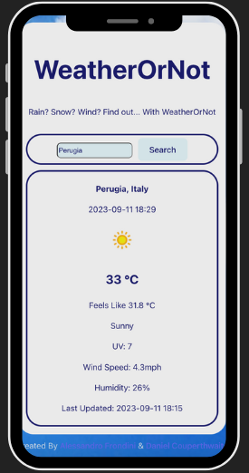

## WeatherOrNot

WeatherOrNot is a simple web app designed to handle requests and to an external api and return relevant weather data to a user.

You can see it in action at https://weatherornot4114.netlify.app/ .

Written by Alessandro Frondini and Daniel Couperthwaite.

## Screenshots

  

# Getting Started

To run this repository locally, simply follow the below steps:

1. Clone the repository
First, clone the repository into a local folder with the command `git clone https://github.com/DanielCouperthwaite/WeatherOrNot.git`
(If you would like to make changes to this repo yourself, simply fork the repository before cloning it.)

2. Enter the repository

Enter the folder that has been created by using `cd WeatherOrNot` in terminal.

3. Install dependencies
To run the app locally, you will need Node. Run the command `npm install` to download the relevant dependencies.

3. Run dev app locally
Running `npm run dev` will deploy WeatherOrNot from local host. 

4. Create an API account
Go to https://www.weatherbit.io/ and create a free account in order to get an API key. 

5. Environment Variable
Finally, create a .env file (similar to .env (example)) and add your API key value.

## Relevant Links

Written by Daniel Couperthwaite (https://www.linkedin.com/in/danielcouperthwaite/) and Alessandro Frondini (https://www.linkedin.com/in/alefrondini/)

https://www.weatherbit.io/ for the source of our api weather information.

Once again, you can check out the live hosted site here: https://weatherornot4114.netlify.app/

Feedback:
Feel free to post bugs at https://github.com/DanielCouperthwaite/WeatherOrNot/issues or send a PR.
